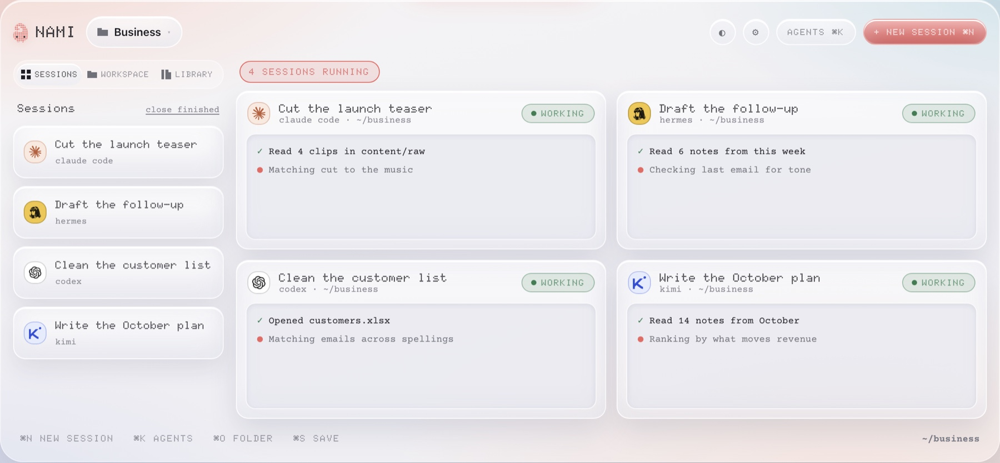
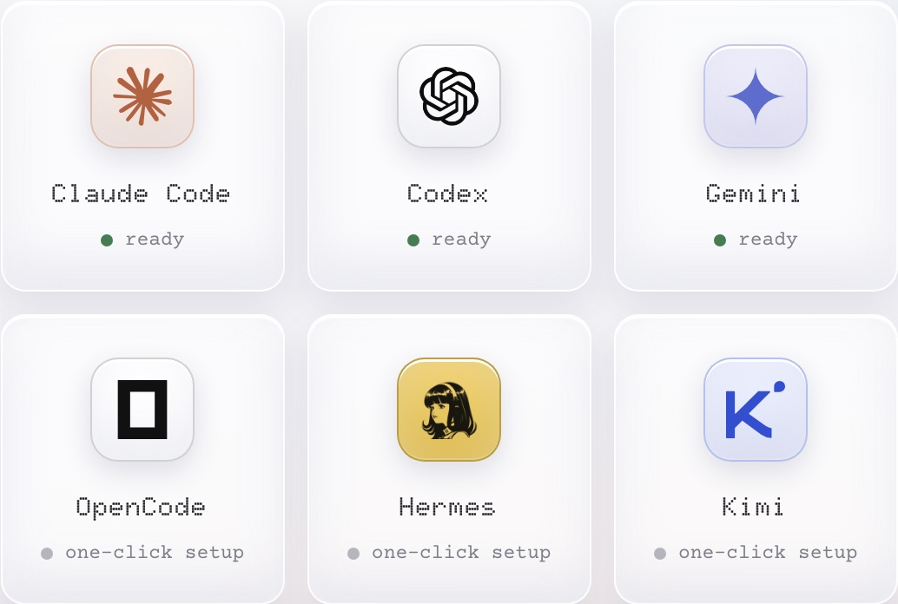
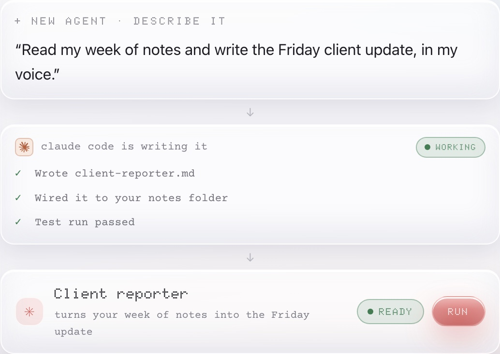
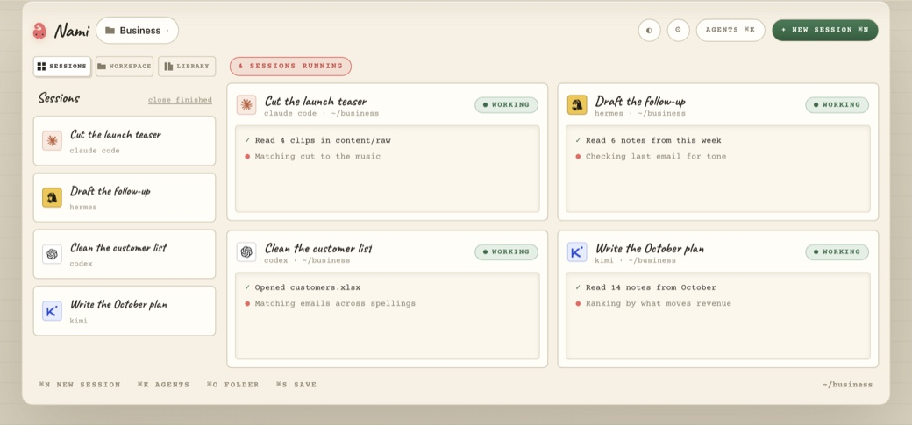
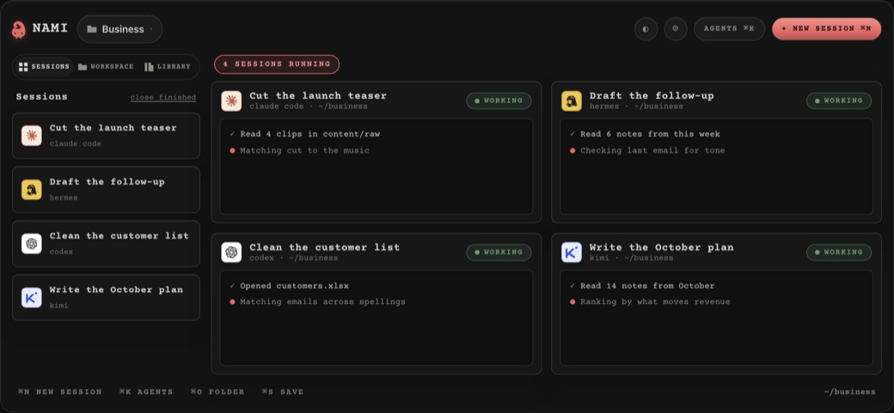
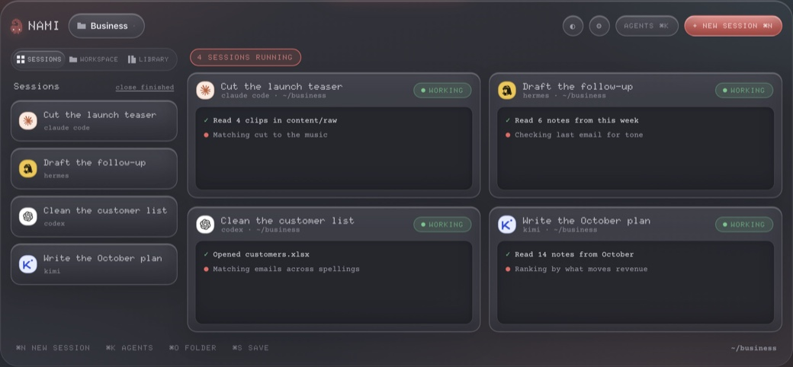

<div align="center">

# KingAgent

### AI Agent Operating Platform

One workspace for all of them. Say what you need in plain English and watch it get done.

**[↓ Download for Windows](https://github.com/MOT1209/KingAgent/releases/latest/download/KingAgent-x64.exe)**
·
**[↓ Download for Mac](https://github.com/MOT1209/KingAgent/releases/latest/download/KingAgent-arm64.dmg)**

Windows 10/11 · macOS 13 or later · free and open source
On an older Intel Mac? [Get the Intel build](https://github.com/MOT1209/KingAgent/releases/latest/download/KingAgent-x64.dmg).

</div>



> KingAgent began as Nami, by Dainami — a Mac-only agent workbench, MIT
> licensed, built by one person. This fork carries that work to Windows and
> onward to a cross-platform AI Agent operating platform. The original macOS
> release lives at [mrdainami/nami](https://github.com/mrdainami/nami).

## What it is

KingAgent is a desk for AI agents. You open one folder, ask for something in
plain English, and an agent gets to work in its own pane — while three others
do something else beside it.

Nothing happens behind your back.

## Run any of the top agents in one click



No more downloading ten different tools only to switch again next week. A better
agent ships next month? Swap it in a click and keep working.

It runs on the subscriptions you already pay for — no KingAgent account, no second bill.

## A morning of work in the time one job used to take

Every job runs in its own pane, all at the same time. One agent writes your
emails, another ships your pricing page, a third sorts the invoices, a fourth
plans your month. One screen, and you are watching all of it.

## Describe an agent. Get an agent.



Say what you want in plain words and seconds later it is on your shelf, ready to
run. Same for skills and connections. Notion, Gmail and Slack connect in one click.

## Four desks

<table>
  <tr>
    <td width="50%"><br><b>Glass</b> — light and airy</td>
    <td width="50%"><br><b>Paper</b> — ink and cream</td>
  </tr>
  <tr>
    <td width="50%"><br><b>Operator</b> — dark ops</td>
    <td width="50%"><br><b>Graphite</b> — glass at night</td>
  </tr>
</table>

## Your files stay on your machine

KingAgent only ever looks inside the one folder you point it at. Dictation runs
on your own machine, so it works on a fresh install with no account, no key and
no network. On macOS every build is signed and notarised; on Windows the
installer is ordinary per-user NSIS — no admin rights, no UAC prompt.

## Get started

**Windows**

1. **[Download the installer](https://github.com/MOT1209/KingAgent/releases/latest/download/KingAgent-x64.exe)** (or the portable `.exe`, which needs no install) and run it.
2. **Point it at one folder** you work in. It never looks outside it.
3. **Ask for something.** It finds the agents you already have — and offers the
   right install command for Windows for the ones you don't.

**macOS**

1. **[Download it](https://github.com/MOT1209/KingAgent/releases/latest/download/KingAgent-arm64.dmg)** and drag KingAgent into your Applications folder.
2. **Point it at one folder** you work in.
3. **Ask for something.**

Find your way around with **⌘ Shortcuts** (Ctrl on Windows) in the app, or read
the [shortcuts and gestures reference](docs/shortcuts.md).

See [docs/windows.md](docs/windows.md) for terminal, PATH and per-agent notes
on Windows.

## Build it yourself

```bash
git clone https://github.com/MOT1209/KingAgent.git
cd KingAgent
npm install
npm start
```

Build installers with `npm run dist:win` (NSIS + portable) or `npm run
dist:mac` (DMG + zip, signing and notarization wired as in the upstream
project). Windows build notes are in [docs/windows.md](docs/windows.md).

Contributor notes are in [CONTRIBUTING.md](CONTRIBUTING.md).

---

## Who makes this

KingAgent is maintained here as a cross-platform fork of Nami, made by
[Cal](https://dainami.ai) — and made **in Nami**. The upstream project and the
MIT license it ships under remain credited in this repository's [LICENSE](LICENSE).

MIT licensed · [Repository](https://github.com/MOT1209/KingAgent) ·
[Issues](https://github.com/MOT1209/KingAgent/issues)
